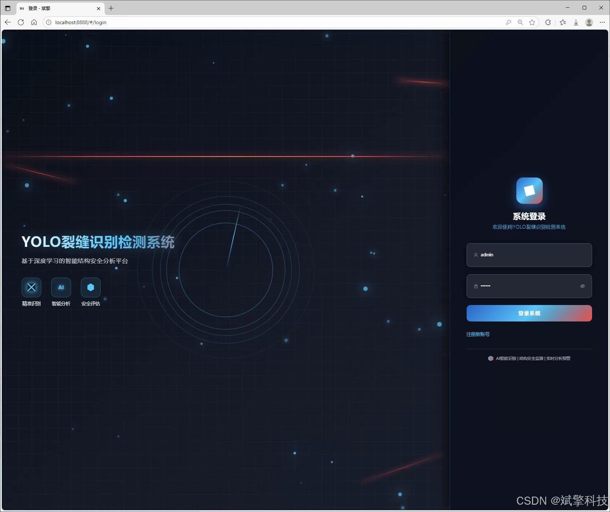
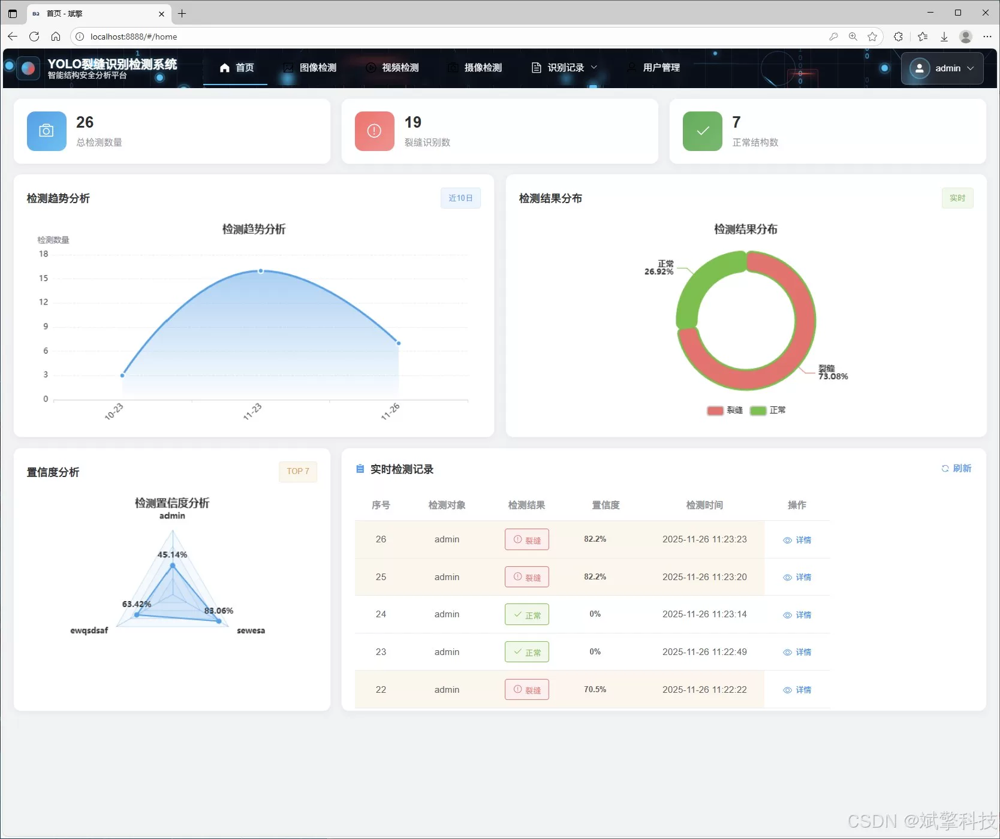
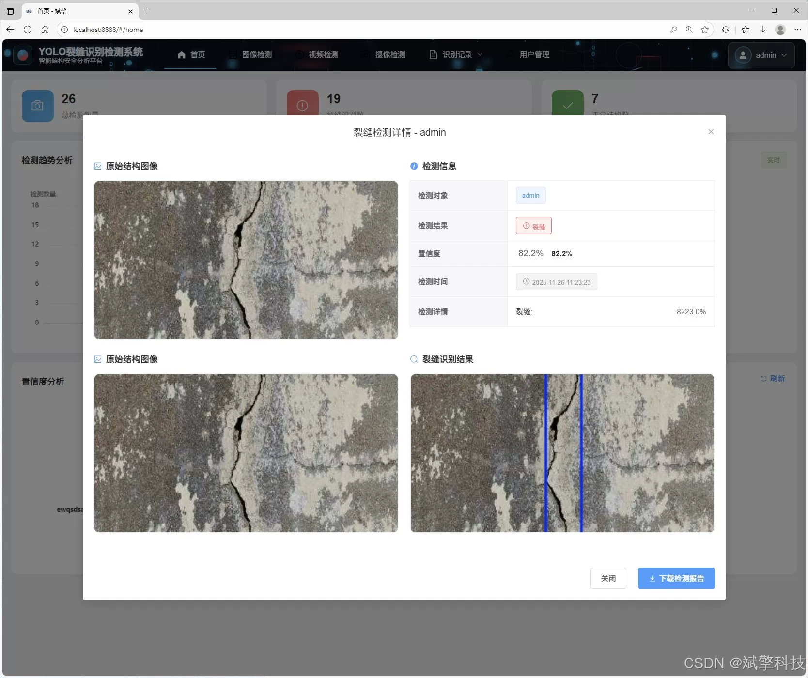
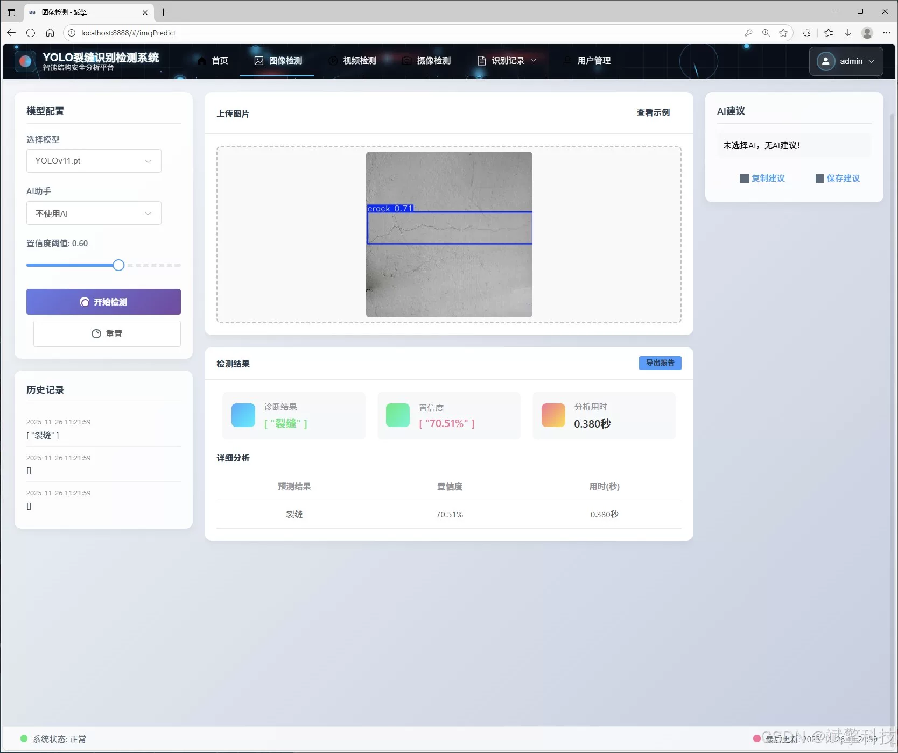
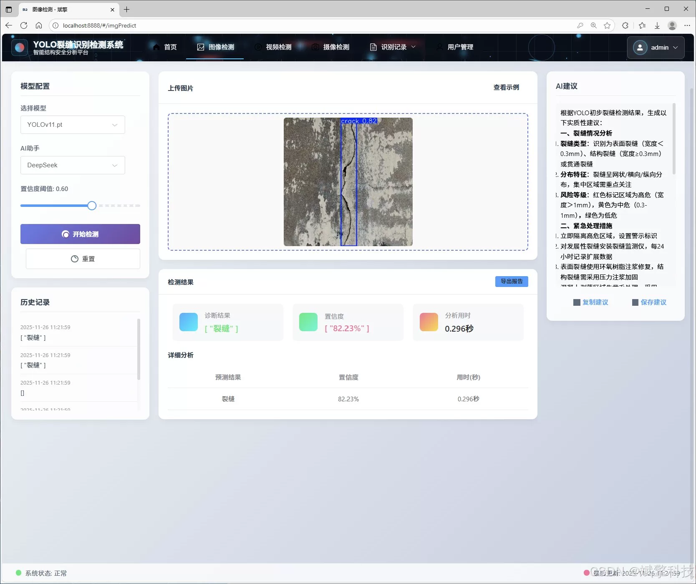
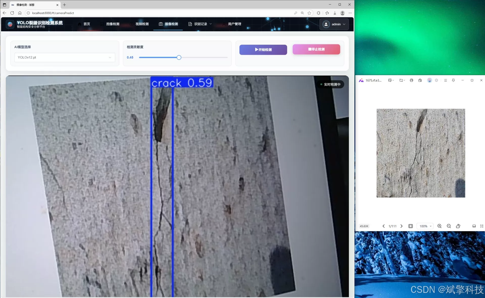
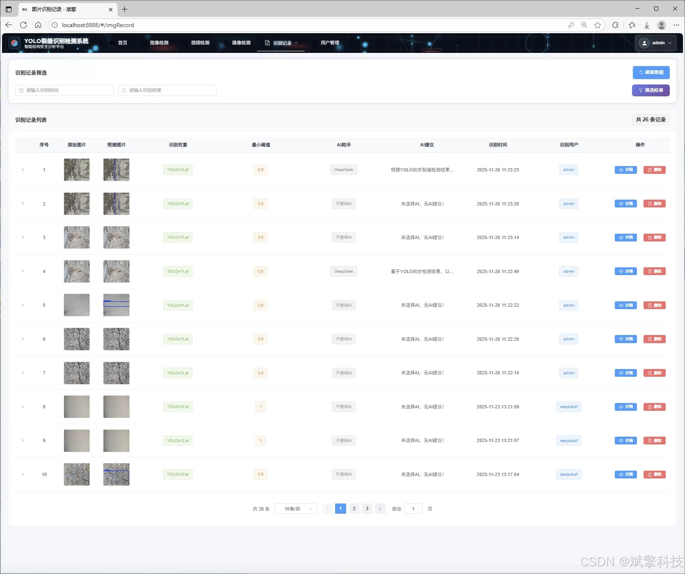
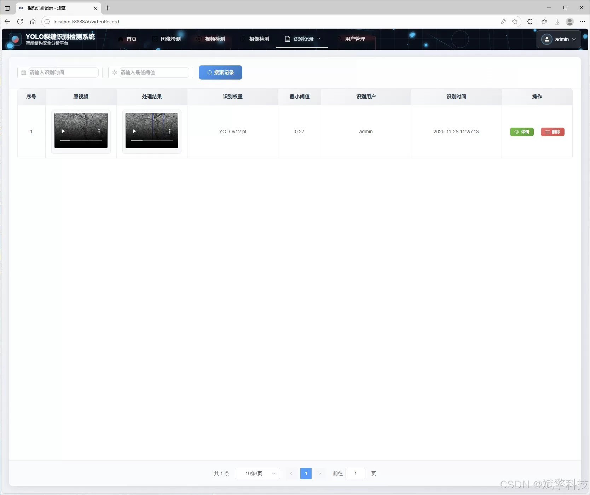
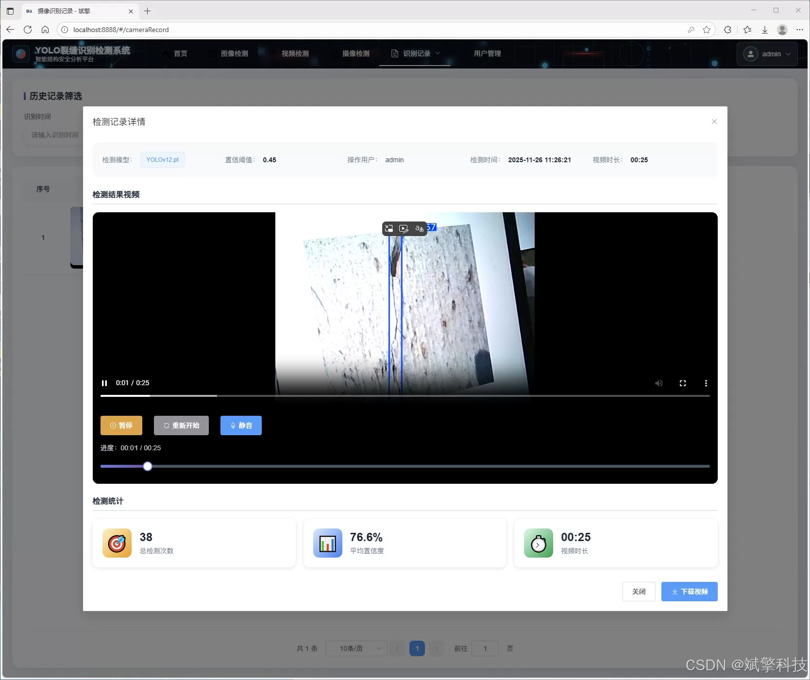

# YOLO+Large Model Crack Detection Intelligent System

## Body

The YOLO+ large model crack intelligent detection system is based on the YOLO deep learning and the crack detection system of Qianwen and DeepSeek big models (DeepSeek intelligent analysis + web interaction interface + front-end and back-end separation + YOLO data + YOLOv8/YOLOv10/YOLOv11/YOLOv12).

This project is a crack intelligent detection system based on advanced deep learning technology, with comprehensive functions and user-friendly interface. The system adopts a modern front-end and backend separation architecture, where the front end uses Vue.js to build a responsive user interface, and the backend uses SpringBoot framework to provide robust API services. The core detection algorithm integrates the latest YOLO series models (v8/v10/v11/v12), providing users with flexible and high-performance model options. In addition, the system innovatively introduces the DeepSeek large language model, which provides intelligent analysis and interpretation of detection results, greatly enhancing the practical value of the system. The system not only supports full-mode detection of images, videos, and real-time camera streams but also equipped with complete user management, data visualization, and record management functions. All data are stored in MySQL database for long-term storage. This project aims to provide an efficient, accurate, and traceable automated crack detection solution for the maintenance of infrastructure such as buildings.

Functional module

✅ Information Visualization, Data Visualization.

✅ Image detection supports AI analysis functions, deepseek and Qianwen.

✅ Supports image detection, video detection, and real-time camera detection. The results are saved to a MySQL database.

✅ Picture recognition record management, video recognition record management and camera recognition record management.

✅ User Management Module, administrators can add, delete, modify, and query users.

✅ Personal center, can modify their own information, password name profile picture and so on.

There is no Lunwen writing service, nor any Lunwen.

## Images

## Payment

Here is a pay link on Stripe ( https://buy.stripe.com/3cs8yP7sY87d0vu9AB ). Please contact me lonlonago@foxmail.com after funding $89, and I will send you a complete data files , thank you!

